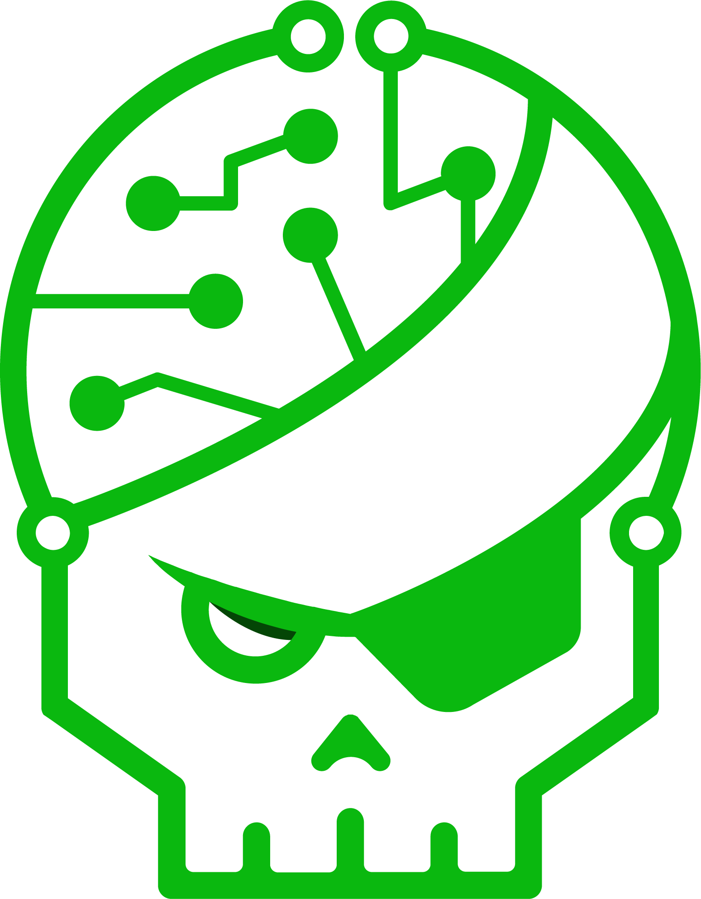

<h1 align="center">Hi , I'm Antoine Bernard </h1>

  

  

  
  
  
  

    

## About me !
- 💡 &nbsp;I like to explore new technologies and develop software solutions and quick hacks.
- 🎓 &nbsp;I'm currently studying Cybersecurity at the University of Paris-Saclay at CentraleSupelec.
- :computer: I did 6month internship in WebScrapping
- ✍️ &nbsp;I did 6month internship in Quality Assurance
- 👨🏽‍💻 &nbsp;I’m currently resolve root-me challenges

 

##  My Programming Skills

### :computer: Programming skills

&nbsp;
&nbsp;
&nbsp;
&nbsp;
&nbsp;
&nbsp;

### :bar_chart: FullStack Development

&nbsp;
&nbsp;
&nbsp;
&nbsp;
&nbsp;
&nbsp;
&nbsp;
&nbsp;
&nbsp;
&nbsp;

### :hammer: Tools

&nbsp;
&nbsp;
&nbsp;
&nbsp;
&nbsp;
&nbsp;

### :memo: Others

&nbsp;
&nbsp;
&nbsp;
&nbsp;
&nbsp;
&nbsp;
&nbsp;

##  Root-me

 

  

*(actually 1530pts)*
